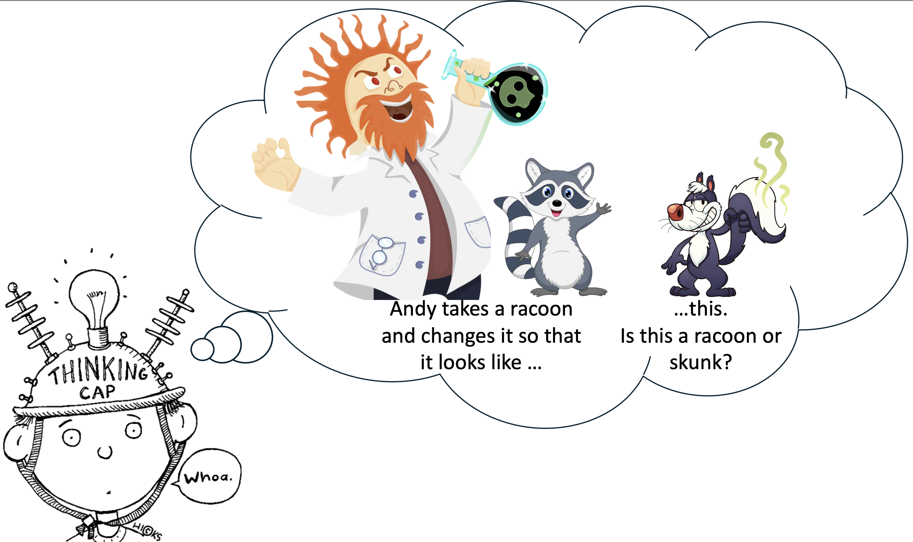

# Teleological essentialism in development

This repository contains the experiments, data, analyses, and figures for the paper "Teleological essentialism in development". 
<!-- by David Rose, Jadess Lowery, Siying Zhang, and Ellen Markman. -->

<!-- The preprint can be found [here](https://davdrose.github.io/assets/pdf/teleological_essentialism_development.pdf) -->

__Contents__:
- [Introduction](#Introduction)
- [Repository structure](#Repository-structure)

## Introduction



<br clear="left" />
<br clear="right" />

Overcoming appearances in categorizing is an important intellectual achievement. But children often rely heavily on appearances, as classic shape similarity (Landau, Smith, & Jones, 1988) and perceptual transformation tasks (Keil, 1989) show. We propose that children can rely on purposes to overcome appearances when categorizing not only artifacts, but biological kinds as well. Across three experiments, with 570 US based children, we find support for this. Children successfully categorized dissimilar-looking objects together based on shared purposes, both at basic (Experiment 1) and superordinate levels (Experiment 2). Children also used an object’s purpose to judge that it maintained its identity in the face of radical perceptual transformations (Experiment 3). We discuss our results in the context of essentialism. Some have proposed that scientific essences - placeholders for what gives something its identity that science fills out - might help children overcome appearances, but this requires a protracted development since scientific elaboration is challenging and rare (Gelman, 2003). Instead, we suggest that children can readily treat purposes as essences. That children can elaborate placeholders with purposes for biological kinds suggests a reorientation of essentialism.


## Repository structure

```
├── code
│   ├── R
│   └── experiments
│       ├── experiment1
│       ├── ...
├── data
│   ├── experiment1
│   ├── experiment2
│   └── experiment3
├── docs
└── figures
    ├── experiment1
    ├── experiment2
    ├── experiment3

```

- `code/` contains all the code for the experiments, analyzing data and generating figures.
- `experiments` contains materials and code for each experiment that was run. Pre-registrations for all experiments are linked below.
  - `experiment1` ([pre-registration](https://osf.io/2gebc/?view_only=c7549494d3174a4aaa5187d7fbc828b5)) was run asynchronously in Lookit.
	- `experiment2` ([pre-registration](https://osf.io/uzhw8/?view_only=da1f3cedeb8a4098a5f9bcad7fb0d6a0)) was run synchronously over Zoom. 
  - `experiment3` includes a two-part norming study and the experiement  
    - two part norming study:
	      - `part1` ([pre-registration](https://osf.io/pb4wa/?view_only=be7a8a2936ac4267a65f71b73e4e037a)) and `part2` ([pre-registration](https://osf.io/8v5yk/?view_only=e680dc8aab404690865eb160e38b0480)) were run asynchronously in Lookit.
      - experiment:
    - `experiment` ([pre-registration](https://osf.io/mrqdx/?view_only=5fd12932202f48349446345c4342ab19)) was run asynchronously in Lookit.
    <!-- - `experiment1` ([pre-registration](https://osf.io/2gebc)) was run asynchronously in Lookit.
	  - `experiment2` ([pre-registration](https://osf.io/uzhw8)) was run synchronously over Zoom. 
    - `experiment3` includes a two-part norming study and the experiement  
      - two part norming study:
	      - `part1` ([pre-registration](https://osf.io/pb4wa)) and `part2` ([pre-registration](https://osf.io/8v5yk)) were run asynchronously in Lookit.
      - experiment:
        - `experiment` ([pre-registration](https://osf.io/mrqdx)) was run asynchronously in Lookit. -->
  <!-- - `R` contains the analysis scripts that were used to analyze data and generate figures
     (view a rendered file [here](https://davdrose.github.io/teleological_essentialism_development/)). -->
- `R` contains the analysis scripts that were used to analyze data and generate figures
     (view a rendered file by clicking `website` above).
- `data/` contains anonymized data from all experiments:
  - `experiment1` contains `exp1.csv` which includes trial and demographic data. 
  - `experiment2` contains `exp2.csv` which includes the trial and demographic data.
  - `experiment3` contains `exp3_norm_part1.csv`, `exp3_norm_part2.csv`, adn `exp3.csv` which includes the trial demographic data for each respective experiement.
- `docs/` contains R code for viewing
- `figures/` contains all the figures from the paper (generated using the script in `code/R/`). 
